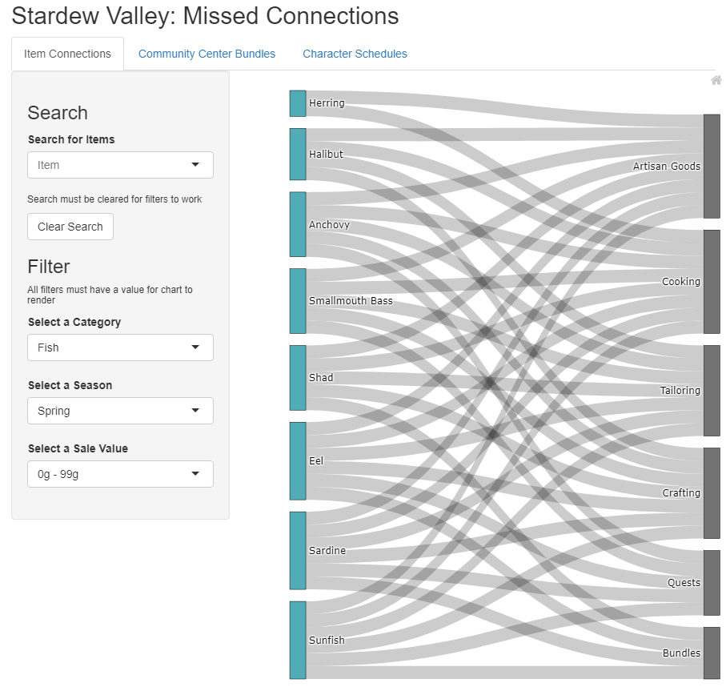
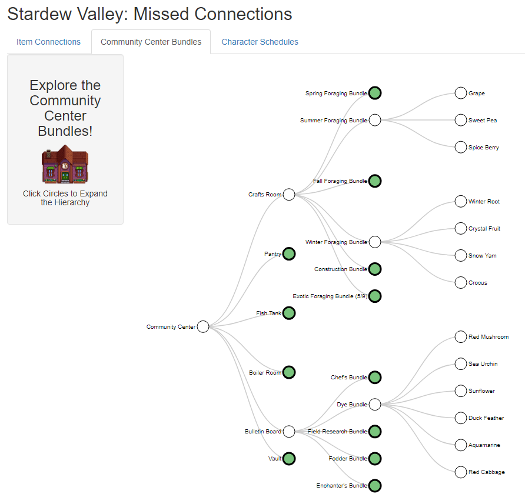
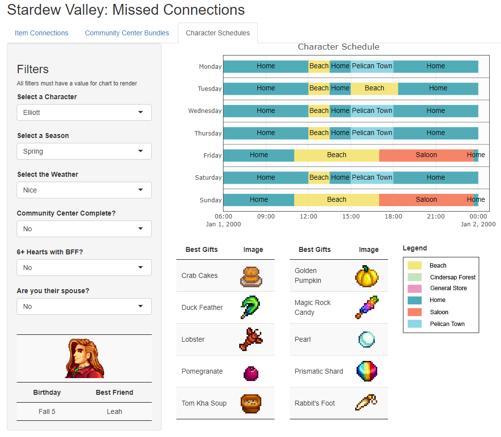

# Stardew Valley: Missed Connections
This is an R Shiny application based on data from the game Stardew Valley

## Motivation
Created as my Masters thesis for the Information and Data Visualization program at MICA. Serves as a data visualization based tool for players that puts key game information all in one place and in cool charts.

## Build Status
Complete and functional, but with potential for future updates if I revisit it

## Screenshots

## Built With R Shiny
#### Libraries required:
* shiny
* shinywidgets
* tidyverse
* collapsibletree
* vistime
* plotly
* DT

## Features
* Original datasets
* Three interactive charts

## How to Use
Access my most current version of the app at: mandrews.shinyapps.io/stardewvalley/

Or feel free to download the app.r file, associated R scripts, and my datasets! 

If you do, note that the scripts are NOT connected to the app.r file, but are where you can update or change the data used in the app. They are where the .rds data files referenced at the top of the app.r file come from, so if you want to update or change the data in the app, you must start with the chart's associated script.

## Inspiration

**Nadieh Bremer's Ode to Cardcaptor Sakura:**

https://www.visualcinnamon.com/portfolio/cardcaptor-sakura

**Pantheon Alluvial Diagram on Behance:**

https://www.behance.net/gallery/26338543/PANTHEON-Corriere-della-Sera-La-Lettura-181

**Lookup Anything Mod for Stardew Vallley:**

https://github.com/Pathoschild/StardewMods/tree/stable/LookupAnything#showcase

## Key Resources Consulted
**Layout:**

https://stackoverflow.com/questions/44222796/shiny-with-multiple-tabs-and-different-sidebar-in-each-tab

**Reactive Filters:**

https://www.davidsolito.com/post/conditional-drop-down-in-shiny/

** Note that the tutorial didn't fully work, but the 3rd comment by Arnaud Gaborit does! 

**Sankey Diagram Data Structure:**

https://stackoverflow.com/questions/57332088/create-shiny-app-with-sankey-diagram-that-reacts-to-selectinput

**Mastering Shiny by Hadley Wickham:**

https://mastering-shiny.org/index.html

And of course, all the official R Shiny documentation available online!

## Sources
**The Stardew Valley Wiki!**

https://stardewvalleywiki.com/Stardew_Valley_Wiki

**Some of my datasets were based on or supplemented with data from reddit user u/LasagnaTheories:**

https://www.reddit.com/r/StardewValley/comments/48s9f6/a_massive_stardew_valley_spreadhseet/

## Public Use
All my files, scripts, and datasets are available to download and use, but no one will be able to edit my hosted app as thesis committee members may reference it at that location in the future. Feel free to recreate or create your own!
